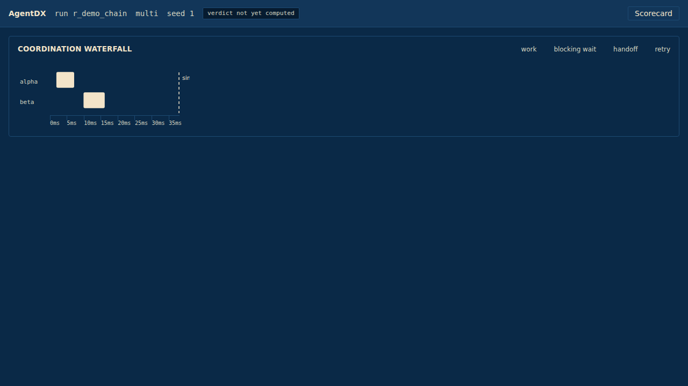

# AgentDX Control Tower

The frontend for AgentDX — a debugger for multi-agent coordination. This build (P15,
CONTEXT.md §5) delivers the shell, the design token system, the Zustand store, a generated
API client, and two panels: the Waterfall (with the ghost baseline, PRD §29.4's signature
element) and the Scorecard (PRD §17.4). Graph, Findings, Chaos and Timeline are out of scope
here — they land at P16.

## Week-8 demo milestone

The ghost baseline — a dashed line marking where a single-agent baseline would have finished,
rendered *behind* the multi-agent waterfall so every bar extending past it reads as visible
overhead:



This is the panel's second, populated state (PRD §29.4). The real, currently-shipped backend
route (`GET /api/runs/{id}/waterfall`) always returns `baseline_makespan_ms: null` today — no
baseline-execution pipeline exists yet (P17/RunHost gap, declared in the route's own
docstring) — so the panel also has, and is tested against, a first "pending" state (a spinner
and "not yet computed" label) that is what every real run in this build actually shows right
now. The numbers in the screenshot above (`2.00×`, baseline 38ms vs multi-agent 19ms) are real
`analysis.baseline.compare()` output for the codebase's own `_chain_log()`/`_chain_baseline()`
fixture — see `tests/frontend/fixtures/README.md` for exactly how every fixture in this build
was produced and why.

## Structure

- `src/tokens.css` — the design token system (PRD §29.1). Every colour in every component
  comes from here; a literal hex value in a `.tsx` file is a CI-graded defect
  (`npm run check:hex-literals`).
- `src/store/` — the Zustand slices (`run`, `selection`, `timeline`, `findings`). Panels never
  own selection or derived state themselves (CONTEXT.md §11 tripwire 8).
- `src/api/` — generated, never hand-written. `npm run generate:api` runs
  `openapi-typescript` against the real `docs/openapi.json`, then a small patch script (see
  `scripts/patch-schema-jsonvalue.mjs`) that works around a TypeScript checker limitation with
  one recursive schema — declared in CONTEXT.md's ADR log, not silently invisible.
- `src/panels/Waterfall.tsx`, `src/panels/Scorecard.tsx` — this build's two panels.
- `tests/frontend/` — `unit/` (Vitest: token contrast matrix, the scorecard parser, the
  bucket→fill ruling, the perf-motivated span-window binary search, and the run-loading
  slice) and `e2e/` (Playwright: all three golden waterfall fixtures with the ghost baseline,
  the full §17.4 scorecard, axe-core accessibility, keyboard navigation, and the NFR-3 perf
  gate). `tests/frontend/fixtures/README.md` documents exactly where every fixture's numbers
  came from.

## Running things

```
npm install
npm run generate:api      # regenerate src/api/schema.ts from docs/openapi.json
npm run typecheck
npm run lint
npm run check:hex-literals
npm run test:unit
npm run gen:fixtures       # regenerate the synthetic 5,000-span perf fixture
npm run test:e2e
npm run test:perf          # just the NFR-3 gate
```
